# RISC-V Assembler and Pipelined Simulator

## Overview

This project includes a comprehensive RISC-V assembler that converts RISC-V assembly code into machine code, and a pipelined simulator that executes the machine code with advanced features such as hazard detection, data forwarding, and branch prediction.

The assembler supports a wide range of standard RISC-V instruction formats and data directives, producing binary representations of each instruction along with their corresponding hexadecimal machine code and memory addresses.

The simulator implements a 5-stage pipeline (Fetch, Decode, Execute, Memory Access, and Writeback) with configurable options for visualization and execution control.

## Table of Contents

- [Features](#features)
  - [Assembler Features](#assembler-features)
  - [Simulator Features](#simulator-features)
- [Project Structure](#project-structure)
- [How It Works](#how-it-works)
  - [Assembly Process](#assembly-process)
  - [Simulation Process](#simulation-process)
- [Installation](#installation)
- [Usage](#usage)
  - [Assembler Usage](#assembler-usage)
  - [Simulator Usage](#simulator-usage)
- [Output Format](#output-format)
- [Error Handling](#error-handling)
- [Contributors](#contributors)

## Features

### Assembler Features

- **Complete RISC-V Instruction Support**:
  - **R-type**: add, sub, and, or, xor, sll, srl, sra, slt, mul, div, rem, neg
  - **I-type**: addi, andi, ori, xori, jalr, not
  - **Load instructions**: lb, ld, lh, lw
  - **S-type/Store instructions**: sb, sh, sw, sd
  - **SB-type/Branch instructions**: beq, bne, bge, blt, bgt, ble, beqz, bnez
  - **U-type**: auipc, lui
  - **UJ-type**: jal, j

- **Data Directive Support**:
  - `.word`: 32-bit data
  - `.half`: 16-bit data
  - `.byte`: 8-bit data
  - `.dword`: 64-bit data
  - `.asciiz`: Null-terminated ASCII strings

- **Label Management**:
  - Support for defining and referencing labels
  - Two-pass assembly approach for resolving label addresses

- **Detailed Output**:
  - Memory addresses in hexadecimal
  - Machine code in hexadecimal
  - Original instruction or data directive
  - Binary encoding details for instructions
  - Section markers for text and data segments

### Simulator Features

- **Five-Stage Pipeline Implementation**:
  - Fetch (IF)
  - Decode (ID)
  - Execute (EX)
  - Memory Access (MEM)
  - Writeback (WB)

- **Advanced Pipeline Features**:
  - **Data Hazard Detection Unit (HDU)**: Detects and resolves data hazards
  - **Data Forwarding**: Configurable option to forward data between pipeline stages
  - **Branch Prediction**: Implements branch target buffer (BTB) and pattern history table (PHT)
  - **Pipeline Stalling**: Handles stalls for load-use hazards and other dependencies

- **Simulation Visualization**:
  - Register file state display
  - Pipeline register state visualization
  - Per-instruction status tracking
  - Cycle-by-cycle execution with visual feedback

- **Configurable Knobs**:
  - Toggle pipeline execution mode
  - Enable/disable data forwarding
  - Toggle register file visibility
  - Toggle pipeline register visibility
  - Highlight specific instruction in pipeline
  - Toggle instruction visualization
  - Control instruction detail display

- **Memory System**:
  - Separate instruction and data memory
  - Support for different data sizes (byte, half-word, word)

## Project Structure

```
README.md            # This file
risc-v-assembler/
├── main.cpp         # Main driver program for assembler
├── commands.cpp     # Instruction encodings and format checking
├── utils.cpp        # Utility functions
├── simulator.cpp    # RISC-V simulation environment implementation
├── components.hpp   # Header file defining simulator components
example/
├── a.exe            # Compiled program
├── input.asm        # RISC-V assembly program to be assembled
└── output.mc        # Assembled machine code
attachments/
└── ok.svg           # Diagram explaining the working of the assembler
```

### File Descriptions

1. **main.cpp**: The main driver program that orchestrates the assembly process, including file I/O, two-pass assembly, and output generation.
2. **commands.cpp**: Defines opcode, function code, and other binary encodings for RISC-V instructions according to the RISC-V specification.
3. **utils.cpp**: Contains utility functions for binary/hexadecimal conversions, string manipulation, and other helper functions.
4. **simulator.cpp**: Implements a RISC-V simulator that emulates instruction execution, handling stages such as Fetch, Decode, Execute, Memory Access, and Writeback.
5. **components.hpp**: Header file defining the data structures and classes for simulator components, including pipeline registers, memory systems, and control circuits.

## How It Works



### Assembly Process

The assembler uses a two-pass approach to resolve labels and generate machine code:

#### First Pass
1. Scan through the entire assembly file
2. Record the addresses of all labels
3. Track the current address in both text and data segments
4. Distinguish between `.text` and `.data` sections

#### Second Pass
1. Process each instruction and data directive
2. For instructions:
   - Tokenize the instruction
   - Generate binary code based on instruction format
   - Convert binary to hexadecimal
   - Output memory address, machine code, and instruction details
3. For data directives:
   - Process `.word`, `.half`, `.byte`, `.dword`, and `.asciiz` directives
   - Output memory address and data values

### Simulation Process

The simulator executes the machine code through a pipelined approach:

1. **Initialization**:
   - Initialize register file
   - Parse machine code file
   - Set up memory (instruction and data)
   - Initialize branch target buffer and pattern history table

2. **Pipeline Execution**:
   - **Fetch**: Retrieve instruction from memory based on PC
   - **Decode**: Decode instruction and read registers
   - **Execute**: Perform ALU operations
   - **Memory Access**: Access data memory if required
   - **Writeback**: Write results back to registers

3. **Pipeline Hazard Handling**:
   - **Data Hazards**: Detected by HDU, resolved through stalling or forwarding
   - **Control Hazards**: Handled by branch predictor with BTB and PHT
   - **Structural Hazards**: Managed through pipeline design

4. **Visualizations**:
   - Display pipeline stages and registers
   - Show register file contents
   - Provide detailed instruction tracking

## Installation

### Build from Source
1. Clone this repository:
   ```bash
   git clone "https://github.com/yourusername/CS204-Project.git"
   cd risc-v-assembler
   ```

2. Compile the source code:
   ```bash
   g++ -std=c++11 main.cpp commands.cpp utils.cpp -o riscv-assembler
   g++ -std=c++11 simulator.cpp components.cpp -o riscv-simulator
   ```

## Usage

### Assembler Usage

```bash
./riscv-assembler <input_file> <output_file>
```

Where:
- `<input_file>` is the path to the RISC-V assembly source file
- `<output_file>` is the path where the assembled output will be written

#### Example
```bash
./riscv-assembler program.asm program.mc
```

### Simulator Usage

```bash
./riscv-simulator [run_time] [debug_mode] [register_file] [pipeline_registers] [instruction_highlight] [show_instructions] [show_details]
```

Where:
- `run_time` (optional): Number of cycles to run (default: 2)
- `debug_mode` (optional): Enable/disable debug info (0 = off, 1 = on, default: 0)
- `register_file` (optional): Show register file (0 = off, 1 = on, default: 1)
- `pipeline_registers` (optional): Show pipeline registers (0 = off, 1 = on, default: 1)
- `instruction_highlight` (optional): Instruction number to highlight (default: 1)
- `show_instructions` (optional): Show instructions in pipeline (0 = off, 1 = on, default: 1)
- `show_details` (optional): Show fetched instruction details (0 = off, 1 = on, default: 1)

#### Example
```bash
./riscv-simulator 10 1 1 1 3 1 0
```
This runs the simulator for 10 cycles with debug mode on, showing register file and pipeline registers, highlighting instruction 3, showing pipeline instructions, but without detailed instruction info.

#### Execution Modes
- **Run Mode**: Execute the entire program at once
- **Step Mode**: Execute one instruction at a time, waiting for user input between steps

## Output Format

### Assembler Output
The output file contains:
- Memory addresses (in hexadecimal)
- Machine code (in hexadecimal)
- Original instruction or data directive
- For instructions: binary encoding details (opcode, function codes, registers, etc.)
- Markers for the end of text and data sections

#### Example Output
```
0x00000000 0x00A62023 , sw x10,0(x12) # 0100011-010-NULL-00000-01100-01010-NULL
0x00000004 0x00358393 , addi x7,x11,3 # 0010011-000-00011-01011-00111-NULL-NULL
...
End of text segment
0x10000000 0x00000001 , .word 1
0x10000004 0x00000002 , .word 2
...
End of data segment
```

### Simulator Output
The simulator provides detailed information about the execution state:

- **Register File**: Shows contents of all registers
- **Pipeline Registers**: Shows values of inter-stage registers (RA, RB, RM, RZ, RY)
- **Memory Registers**: Shows MAR and MDR values for instruction and data memory
- **IAG Registers**: Shows IR and PC values
- **Instructions in Pipeline**: Shows which instructions are in each pipeline stage
- **Instruction Details**: Shows detailed information about the fetched instruction

## Error Handling

The assembler performs various error checks:
- Invalid instruction formats
- Invalid register numbers
- Immediate values out of range
- Invalid numeric data in data directives
- Missing or inaccessible input/output files

The simulator handles error conditions such as:
- Divide by zero operations
- Invalid memory accesses
- Instruction execution errors

Error messages are printed to standard error with information about the specific issue encountered.

## Contributors

- 2023csb1102	Aryan Singh
- 2023csb1126	Kanwarveer Singh Chadha
- 2023csb1147	Pratham Garg